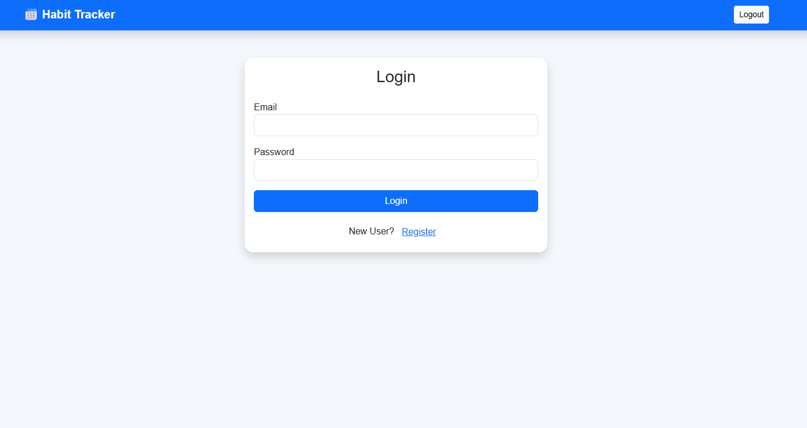
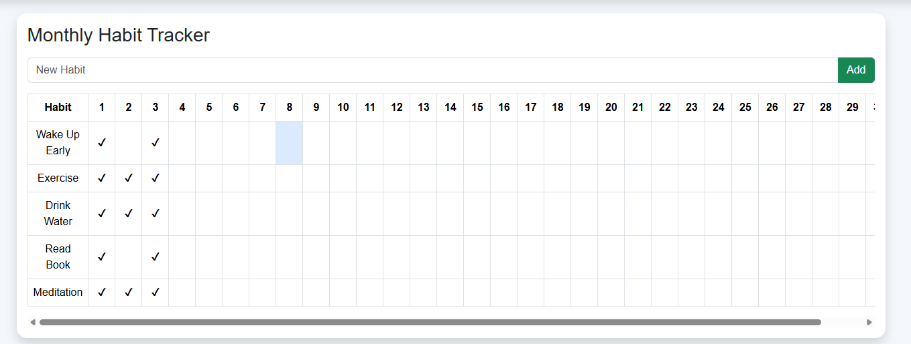
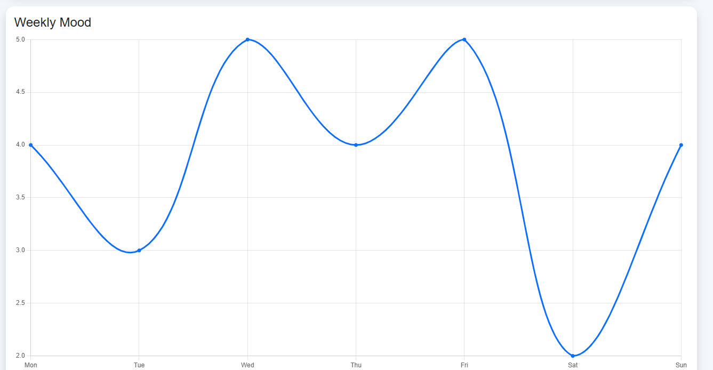

# 📅 Habit Tracker - 3 Tier Dockerized Application

A full-stack **Habit Tracker** application built using a **3-Tier Architecture** with **React**, **Node.js (Express)**, and **MySQL**. The project is fully containerized using **Docker** and orchestrated with **Docker Compose**, making it easy to deploy and scale.

---

# 📌 Features

- 👤 User Registration & Login
- 🔐 JWT Authentication
- ✅ Create Daily Habits
- ✏️ Update Habits
- ❌ Delete Habits
- 📅 Monthly Habit Tracker
- 😊 Mood Tracking
- 📊 Habit Progress Dashboard
- 📈 Weekly Mood Chart
- 🐳 Dockerized Frontend & Backend
- 🗄️ MySQL Database
- ⚡ REST API
- 📦 Docker Compose
- ☁️ Kubernetes Ready

---

# 🏗️ Architecture

```
                React Frontend
                       │
                  REST API (Axios)
                       │
                Express Backend
                       │
                  Sequelize ORM
                       │
                     MySQL
```

---

# 🛠️ Tech Stack

## Frontend

- React.js
- Bootstrap 5
- Axios
- Chart.js

## Backend

- Node.js
- Express.js
- JWT
- bcrypt
- Sequelize ORM

## Database

- MySQL 8

## DevOps

- Docker
- Docker Compose
- Nginx

---

# 📂 Project Structure

```text
habit_tracker/
│
├── backend/
│   ├── app.js
│   ├── package.json
│   ├── Dockerfile
│   ├── config/
│   ├── controllers/
│   ├── middleware/
│   ├── models/
│   └── routes/
│
├── frontend/
│   ├── Dockerfile
│   ├── nginx.conf
│   ├── package.json
│   ├── public/
│   └── src/
│
├── database/
│   └── init.sql
│
├── docker-compose.yml
├── .env
└── README.md
```

---

# 🚀 Getting Started

## Clone Repository

```bash
git clone https://github.com/yourusername/habit-tracker.git

cd habit-tracker
```

---

# Create Environment File

Create a `.env` file in the project root.

```env
MYSQL_ROOT_PASSWORD=rootpassword
MYSQL_DATABASE=habitdb
MYSQL_USER=habituser
MYSQL_PASSWORD=habitpassword

DB_HOST=mysql
DB_PORT=3306
DB_NAME=habitdb
DB_USER=habituser
DB_PASSWORD=habitpassword

JWT_SECRET=mysecretkey

PORT=5000
```

---

# Run Application

```bash
docker compose up --build
```

---

# Stop Application

```bash
docker compose down
```

---

# Remove Containers & Volumes

```bash
docker compose down -v
```

---

# 🌐 Access Application

| Service | URL |
|----------|-----|
| Frontend | http://localhost:3000 |
| Backend API | http://localhost:5000 |
| MySQL | localhost:3307 |

---

# 📡 REST API

## Authentication

| Method | Endpoint |
|---------|----------|
| POST | /api/auth/register |
| POST | /api/auth/login |

---

## Habits

| Method | Endpoint |
|---------|----------|
| GET | /api/habits |
| POST | /api/habits |
| PUT | /api/habits/:id |
| DELETE | /api/habits/:id |

---

## Mood

| Method | Endpoint |
|---------|----------|
| GET | /api/moods |
| POST | /api/moods |

---

# 🐳 Docker Commands

## Build Images

```bash
docker compose build
```

## Start Containers

```bash
docker compose up
```

## Start in Background

```bash
docker compose up -d
```

## View Logs

```bash
docker compose logs
```

## Stop Containers

```bash
docker compose down
```

---

# 🔍 Verify Containers

```bash
docker compose ps
```

Expected output:

```
habit-mysql      Up
habit-backend    Up
habit-frontend   Up
```

---

# 📷 Screenshots
```
## Login Page

<p align="center">
  
</p>

```

## Habit Tracker

```
<p align="center">
  
</p>
```
## Mood Chart

```
<p align="center">
  
</p>

---

# 🔮 Future Improvements

- Email Verification
- Password Reset
- User Profile
- Dark Mode
- Weekly Reports
- Notifications
- Docker Health Checks
- Kubernetes Deployment
- CI/CD Pipeline using GitHub Actions
- Helm Charts
- Monitoring with Prometheus & Grafana

---

# 👨‍💻 Author

**Mohd Fahad Khan**

GitHub: https://github.com/fahadkh14

LinkedIn: https://www.linkedin.com/in/mohd-fahad-khan-06b39533b

---

# ⭐ Support

If you found this project helpful, please consider giving it a ⭐ on GitHub.

---

# 📄 License

This project is licensed under the MIT License.
